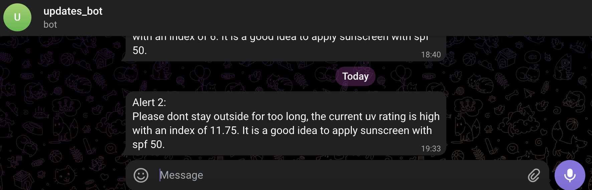

# solid-octo-spoon
## CS462 Group Project
Dashboard developed for an IoT project that involves measuring humidity, UV and temperature such that insights can be generated for a user about their heat and sun levels. 

Generally, the flow of the application is as follows. Raw data is stored on Mongodb and the entirity of processing occurs within the Flask backend which is then queried via GET & POST requests from the Vue frontend in order to be displayed by the user. Adafruit wearable sends data to mobile app before mobile app publishes data via MQTT protocol to web server. Webserver subscribes to data from topic and stores data in mongodb. System architecture:


### Dependencies:
#### Python Dependencies
- Flask 
- Pandas
- Mongodb
- PahoMQTT
- scikit-learn

#### Javascript Dependencies
These dependencies are included in the static files however they are listed as follows:
- Bootstrap
- Chartjs
- MaxBoxGL
- Vue

#### Steps to set up:
1. Run `pip install -r requirements.txt` in order to download the required dependencies
2. Run app.py  with command <code>python app.py</code> 
3. Enter http://localhost:5012 on browser to view dashboard.

## Main Homepage 
The website can be seen below. Various visualisations were created. The main chart is the timeseries chart which can be configured to show either of three metrics over some length of time. 
As well as this the user can see the real-time measuring of data when the measurement device is connected and sending out the necessary data. 
Alerts created by the user is also displayed along with warnings generated by the webpage. 


The alerts are displayed as follows:


Example of an alert sent via Telegram with specific recommendation:



Upon ungraceful disconnect of device, 
server will receive "Publisher unexpectedly disconnected" message with this configuration:
```
# Last Will Configurations:
app.config['MQTT_LAST_WILL_TOPIC'] = topic
app.config['MQTT_LAST_WILL_MESSAGE'] = "Publisher unexpectedly disconnected"
app.config['MQTT_LAST_WILL_QOS'] = 1
app.config['MQTT_LAST_WILL_RETAIN'] = True
```

### Key Differences between production system and prototype system:
#### Production system:
- Wearable will be made more compact
- More notification channels 
- User account registration and ability to register telegram and other notification channels present 
- Scalable to more than 1 user with each user's device having a separate topic with name 'cs462/feeds/rx/<device_id>'
- Machine learning model will be improved with richer data for more accurate predictions of time left before experiencing sunburn and danger period for user
- Location data will be added from database in encrypted format before being used to visualise as a heat map
- Data sent from sensors every 5 minute


#### Prototype system:
- Catered to one user with one topic 'cs462/feeds/rx'
- No user account registration available and telegram chat ids for some sample users already added to system 
- Location data visualised on heat map are not collected from multiple users
- Data sent from sensors every few seconds to showcase that the data feed is real time

references: 
https://codepen.io/jordanwillis/pen/bqaGRR
https://codepen.io/andrew_levinson/pen/NYXpvL

https://stackblitz.com/edit/react-chartjs-2-dynamic-update?file=index.js


https://dev.to/emqx/how-to-use-mqtt-in-flask-b11

https://www.eclipse.org/paho/index.php?page=clients/python/index.php

https://stackoverflow.com/questions/68229521/chart-js-multiple-box-annotations-displays-only-the-last-box
